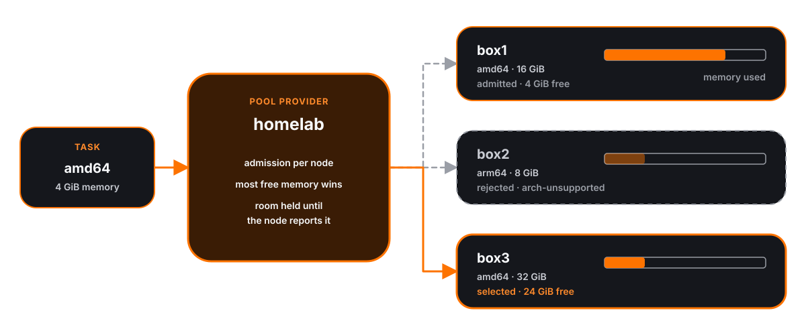

`vagabond agent` runs on a node you own, apart from the server. It dials the
server's `agent_bind` address, registers the node into a named pool, and runs
the workloads the server sends it as containers on the node's containerd. The
server schedules onto the pool through a provider of type `pool`.
`vagabond node status` lists the nodes connected now and how much of each is
in use.

Workloads belong to containerd, not to the agent process: they keep running
when the agent stops or loses the server, and the agent finds them again when
it starts.

## Requirements

| Requirement | Checked at | Failure |
|---|---|---|
| Linux with cgroup v2 (unified hierarchy) | startup | [Startup errors](#startup-errors) |
| Read access to `/proc/meminfo` and `/proc/self/cgroup` | startup | |
| Permission to create cgroups under its own, or `-cgroup-parent` | startup | |
| containerd reachable on `-containerd` | startup | |
| `-data-dir` writable | startup | |
| TCP reach to the server's `agent_bind` | after startup, retried | `connecting to the server` warnings |

The agent needs no inbound port. The server calls it back down the
connection the agent opened.

## Flags

```bash
vagabond agent -server 10.0.0.5:4748 -pool homelab -label gpu=no -memory 12288
```

| Flag | Default | Description |
|---|---|---|
| `-server <addr>` | `127.0.0.1:4748` | The server's `agent_bind` address, `host:port`. |
| `-pool <name>` | `default` | Pool the node joins. Must match the name of a `pool` provider on the server to receive work. |
| `-name <name>` | the hostname | Node name. Unique per server: an agent registering under a name already connected replaces that connection. |
| `-label <key>=<value>` | none | Node label, repeatable. Published to constraints as `node.label.<key>`. A repeated key, an empty key or a value without `=` is a flag error. |
| `-cpu <millicores>` | `0` (no cap) | Upper bound on capacity CPU. |
| `-memory <MiB>` | `0` (no cap) | Upper bound on capacity memory. |
| `-containerd <path>` | `/run/containerd/containerd.sock` | containerd's socket. |
| `-data-dir <path>` | `/var/lib/vagabond` | Workload output, under `<data-dir>/logs`. Created mode `0750` if missing. In a container it must be the same path inside and out. |
| `-cgroup-parent <path>` | empty | cgroup v2 path to create workloads under, prepared by the operator. Skips [cgroup delegation](#cgroup-delegation). |
| `-log-level <level>` | `info` | `debug`, `info`, `warn` or `error`. Logs are text to stderr. |

The full CLI reference is in [CLI](cli.md).

### Startup sequence

1. Parse flags and the log level.
2. Read the node: architecture, host CPU and memory, the agent's cgroup and
   the limits above it ([Capacity](#capacity)).
3. Delegate the agent's cgroup, unless `-cgroup-parent` is set
   ([Cgroup delegation](#cgroup-delegation)).
4. Connect to containerd, create `<data-dir>/logs`, and check that containerd
   answers.
5. Re-arm the timeout of every workload already in the `vagabond` namespace
   ([Agent restarts](#agent-restarts)).
6. Log the node, then dial the server and stay connected until `SIGINT` or
   `SIGTERM`.

```text
level=INFO msg=node name=box1 pool=homelab cpu=4000 memory=12288 cgroup=/system.slice/vagabond-agent.service
level=INFO msg=connected server=10.0.0.5:4748 name=box1 pool=homelab
```

Steps 1 to 5 exit with status 1 on failure, before the node registers. A
server that cannot be reached is not a startup failure; the agent keeps
retrying.

## Capacity

Capacity is what the agent reports it may use, in millicores and MiB. Each
dimension is the smallest of:

| Source | CPU | Memory |
|---|---|---|
| Host | CPUs available to the process × 1000 | `MemTotal` from `/proc/meminfo`, kB / 1024 |
| cgroup chain | `cpu.max` quota × 1000 / period, tightest of the agent's cgroup and every ancestor to the root | `memory.max` bytes / 2^20, tightest of the chain |
| Flags | `-cpu` | `-memory` |

- A `cpu.max` or `memory.max` of `max`, or a file that does not exist, is no
  limit. A flag of `0` is no cap.
- The chain is read from the agent's own cgroup, also when `-cgroup-parent` is
  set.
- Capacity is read once at startup. Changing a limit or a flag takes an agent
  restart.

**Example:** a host with 8 CPUs and `MemTotal: 32791612 kB`, the agent in a
systemd unit with `CPUQuota=400%` and `MemoryMax=16G`, started with
`-memory 12288`:

| Dimension | Host | cgroup chain | Flag | Capacity |
|---|---|---|---|---|
| CPU | 8000 | `400000 100000` = 4000 | none | **4000** |
| Memory | 32023 | 17179869184 B = 16384 | 12288 | **12288** |

Workloads are created under the agent's cgroup, so the kernel holds their sum
to the cgroup limits as well as to the per-workload limits described in
[Workloads](#workloads). `-cpu` and `-memory` are enforced only by the room
checks on the agent and the server, not by the kernel.

## Cgroup delegation

cgroup v2 lets a cgroup either hold processes or hand controllers to children,
not both. At startup the agent prepares its own cgroup to parent workloads:

1. Read its cgroup from the `0::` line of `/proc/self/cgroup`. No such line is
   a cgroup v1 host.
2. If its cgroup already ends in `/agent` (an agent restarted inside its own
   leaf), use the parent of that.
3. Refuse the root cgroup `/`.
4. Create the child `<cgroup>/agent`.
5. Move its own PID into `<cgroup>/agent`.
6. Enable the `cpu` and `memory` controllers in `<cgroup>/cgroup.subtree_control`.
7. Create every workload at `<cgroup>/<execution-id>`.

With `-cgroup-parent`, steps 1 to 6 are skipped and workloads are created at
`<cgroup-parent>/<execution-id>`. The parent must already have `cpu` and
`memory` enabled for its children; the agent does not check.

### Startup errors

| Condition | Error |
|---|---|
| cgroup v1 or hybrid host | `Reading the node: the host is not on cgroup v2, which the agent requires` |
| `/proc/meminfo` unreadable | `Reading the node: reading host memory: ...` |
| Agent's cgroup is `/` (container without `--cgroupns=host`) | `the agent's cgroup is the root. In a container, run it with --cgroupns=host so it sees its real cgroup, or pass -cgroup-parent` |
| cgroup cannot be opened | `loading cgroup <path>: ...` |
| Creating the leaf, moving into it, or enabling controllers is refused | `cannot manage cgroups under <path>: <cause>. Under systemd, set Delegate=yes on the agent's unit; in a container, mount /sys/fs/cgroup writable with --cgroupns=host` |
| Socket missing or unreachable | `connecting to containerd at <socket>: ...` or `containerd at <socket> does not answer: ...` |
| `<data-dir>/logs` cannot be created | `creating the log directory: ...` |
| containerd cannot list containers | `Finding workloads from before: listing containers: ...` |
| Bad `-log-level` | `Invalid -log-level "<value>": use debug, info, warn or error.` |

## Deployment

The agent needs root or equivalent: containerd's socket is root-owned, and
delegation writes to `/sys/fs/cgroup`.

### systemd

```ini
[Unit]
Description=Vagabond agent
After=network-online.target containerd.service
Wants=network-online.target
Requires=containerd.service

[Service]
ExecStart=/usr/local/bin/vagabond agent -server 10.0.0.5:4748 -pool homelab
Delegate=yes
CPUQuota=400%
MemoryMax=16G
KillMode=process
Restart=always
RestartSec=5

[Install]
WantedBy=multi-user.target
```

| Setting | Why |
|---|---|
| `Delegate=yes` | Lets the agent create and manage cgroups below the unit's. Without it, steps 4 to 6 of delegation fail. |
| `CPUQuota=`, `MemoryMax=` | Become the unit cgroup's `cpu.max` and `memory.max`, and so the node's capacity. Optional. |
| `KillMode=process` | Workload processes live in the unit's cgroup subtree. With the default `control-group`, stopping or restarting the unit kills every workload with it. |

### Container

The agent in a container drives the host's containerd, so workloads run on the
host, not inside the agent's container.

```bash
docker run -d --name vagabond-agent --restart unless-stopped \
  --privileged --cgroupns=host \
  -v /run/containerd/containerd.sock:/run/containerd/containerd.sock \
  -v /var/lib/vagabond:/var/lib/vagabond \
  --cpus 4 --memory 16g \
  <image-with-vagabond> agent -server 10.0.0.5:4748 -pool homelab -name "$(hostname)"
```

| Setting | Why |
|---|---|
| containerd socket mounted | The agent creates workloads through it. |
| `--cgroupns=host` | `/proc/self/cgroup` must show the host path of the container's cgroup, since containerd places workloads by that path. Otherwise the agent sees `/` and refuses to start. |
| `--privileged` | Mounts `/sys/fs/cgroup` writable, for delegation. |
| `-data-dir` mounted at the same path | containerd on the host writes workload output to the path the agent names, and the agent reads it back from the same path. |
| `--cpus`, `--memory` | Become the container cgroup's limits, and so the node's capacity. Optional. |
| `-name` | The container's hostname is its ID, which changes when the container is recreated. |

### Nomad

The agent has no Nomad-specific behaviour. As a `raw_exec` task it needs the
same delegation as any process; as a container task, the container settings
above. Capacity comes from the task's cgroup chain, so set `-cpu` and
`-memory` when that chain carries no `cpu.max` or `memory.max`.

```hcl
job "vagabond-agent" {
  type = "system"

  group "agent" {
    task "agent" {
      driver = "raw_exec"

      config {
        command = "/usr/local/bin/vagabond"
        args = [
          "agent",
          "-server", "10.0.0.5:4748",
          "-pool", "homelab",
          "-name", "${node.unique.name}",
          "-cpu", "4000",
          "-memory", "8192",
        ]
      }
    }
  }
}
```

### Server side

The server listens for agents on `agent_bind`, loopback-only by default. For
agents on other hosts, bind an address they can reach:

```hcl
server {
  agent_bind = "10.0.0.5:4748"   # default "127.0.0.1:4748"
}
```

See [`server` block](configuration.md#server-block). A listen failure stops the
server with `Listening for agents on <addr>: ...`.

## Connection and reporting

The agent holds one connection to the server. On it, the agent registers its
node with `Node.Register`, and re-sends the same full report:

| When | Why |
|---|---|
| On connecting | The server learns the node and every workload it still holds. |
| After `Submit` starts a workload | Room taken. |
| After `Cancel` or `Release` | Room freed, workload gone. |
| Every 10 seconds | Catches a workload that finished on its own. |

Signals are coalesced: several changes while a report is pending send one
report. A failed periodic report is logged as `reporting workloads` and not
retried; the next carries everything.

The connection closing is the only liveness signal. There is no separate
heartbeat or timeout on top of TCP and yamux keepalives. When it closes, the
server removes the node (`node disconnected`) and the agent dials again.

**Reconnect backoff:**

| Setting | Value |
|---|---|
| First wait | 1 s |
| Growth | doubles per failed attempt |
| Maximum | 30 s |
| Reset | to 1 s after a session that registered and later dropped |

A dial or first registration that fails logs
`connecting to the server server=... error=... retry=<wait>`. A session that
was up and dropped logs `lost the server`.

The server records each node as it arrives (`node registered node=... pool=...
address=... cpu=... memory=... held=<n>`). Later reports from the same
connection update the node silently. A report under a connected name from a
new connection closes the old connection and replaces it.

Agent reporting is one of the loops listed in
[Background services](background-services.md).

## Pools



### Declaring a pool

A pool is a provider of type `pool` on the server. The provider name is the
pool name agents join with `-pool`.

```hcl
provider "homelab" {
  type = "pool"
}
```

- A pool takes no `config` or `credentials`. It accepts the provider-level
  settings every provider does, such as quota `pool` blocks and `meta`; see
  [`provider` block](configuration.md#provider-block).
- Only `vagabond server` can build a pool. Loading one elsewhere fails with
  the diagnostic `Pool without a server`:
  `Provider "<name>" is a pool, which only vagabond server can run.`
- A pool with no connected nodes is unhealthy
  (`no nodes have joined pool "<name>"`) and admission rejects it with
  `provider-unhealthy`. At server start this appears as
  `Some providers did not answer: ...`, which does not stop the server.
- An agent whose `-pool` names no `pool` provider still connects and appears in
  `node status`, but receives no work.

### Joining

```bash
vagabond agent -server 10.0.0.5:4748 -pool homelab -label gpu=yes -label rack=a
```

A pool's membership is read live on every plan, not from the periodic
refresh: a node is schedulable as soon as it registers, and gone as soon as
its connection closes.

### Node attributes

Each node is one member of the pool, with its own capability snapshot:

| Attribute | Value |
|---|---|
| `provider.drivers` | `container` |
| `provider.architecture` | The agent binary's `GOARCH`, e.g. `amd64`, `arm64` |
| `provider.max_cpu` | Room left, millicores; `0` when full |
| `provider.max_memory` | Room left, MiB; `0` when full |
| `provider.internet` | `true` |
| `provider.private_network` | `true` |
| `provider.arbitrary_images` | `true` |
| `provider.estimated_cost` | `0` |
| `node.label.<key>` | Each `-label` |

No `provider.max_duration` is published: a node sets no duration limit.
Provider `meta` tags and quota are the pool's, shared by every node.

```hcl
constraint {
  attribute = "node.label.gpu"
  value     = "yes"
}
```

See [Attributes](job-specification.md#attributes).

### Admission

Each node is judged on its own, as if it were the whole provider, with its
own snapshot and labels plus the pool's quota, `meta`, health and the job's
allowlist. The pool is admitted when at least one node passes every check,
and the nodes that passed are carried to placement. A task needing `arm64`
and 8 GiB is not admitted because one node is `arm64` and another has 8 GiB
free.

When no node passes, the pool is rejected with the reason code of the node
that failed the fewest checks, its detail prefixed `closest node <name>: `.

See [Admission](scheduling.md#admission) and
[Reason codes](scheduling.md#reason-codes).

### Placement

1. Size the workload: the task's `resources`, with **1000 millicores** for an
   unset or zero `cpu` and **1024 MiB** for an unset or zero `memory`.
2. Among the nodes admission passed, skip any already tried for this
   submission and any whose room is below the workload's size.
3. Pick the node with the most free memory. Ties go to the first by name.
4. Reserve the workload's size on that node, in the same locked step as
   choosing it.
5. Send `Submit` to the node.

The node name is the execution's provider ID.

### Room

A node's room is:

```text
capacity − Σ declared size of running workloads − Σ unexpired reservations not yet reported
```

- Declared sizes, not live usage. Each workload is capped at what it declared,
  so the sum is what the node can be asked for at once.
- A workload whose task has stopped still holds a container until released,
  but no longer counts.
- A container with no task yet counts as running.

### Reservations

A reservation holds room between placing a workload and the node reporting
it, so two dispatches on the same server cannot both take the last room.

| Event | Effect |
|---|---|
| Node reports holding the execution | Reservation no longer counted (the node's report covers it) |
| 2 minutes pass | Reservation no longer counted |
| Node refuses, or `Submit` fails | Reservation dropped |
| Execution released | Reservation dropped |

Reservations are in memory, per server process.

### Refusal and retry

The agent checks room itself, holding a lock across the check and the start:
its running workloads' declared sizes plus the new one must fit capacity. A
resubmission of an execution it already holds always fits and starts nothing
new.

| Agent answer | Pool does |
|---|---|
| `ResourceExhausted` (`the node has <cpu> millicores and <mem> MiB free; the workload needs <cpu> and <mem>`) | Drops the reservation, marks the node tried, and places again on the next node. |
| Any other error | Drops the reservation and returns an infrastructure failure. No other node is tried. |
| Node disconnected between choosing and sending | Infrastructure failure `node <name> left before the workload reached it`. |
| No untried node has room | Infrastructure failure `no node in pool "<pool>" has room for <cpu> millicores and <mem> MiB`. |

An infrastructure failure sends dispatch to the next ranked provider; see
[Dispatch](dispatch.md).

**Sizing in admission:** each node publishes the 1000 millicore / 1024 MiB
default as its default size, so admission checks a task that declares no
resources at the size placement will use. A full node publishes zero room and
is rejected with `resources-exceeded`.

### Node leaving mid-run

When a node's connection closes, the server records when it left. For the
executions it holds:

| Call | Within 5 minutes of leaving | After 5 minutes |
|---|---|---|
| Status | `lost` | Infrastructure failure `node <name> holding <id> is gone` |
| Result, Cancel, Release | Infrastructure failure `the node holding <id> is not connected` | Infrastructure failure `node <name> holding <id> is gone` |

`lost` is not terminal: dispatch keeps polling. A node that reconnects within
the grace period reports its workloads, and they finish normally. After it,
the status failure ends the attempt and dispatch records it `lost`.

**After a server restart**, the server has no record of which node holds an
execution until a node reports it. For the first 5 minutes after the pool
provider is built, an execution no connected node reports is `lost`; after
that it is an unknown execution.

## Workloads

One container per execution, on the node's containerd.

| Property | Value |
|---|---|
| containerd namespace | `vagabond` |
| Container and snapshot ID | The execution ID |
| Runtime | `io.containerd.runc.v2` |
| cgroup | `<parent>/<execution-id>`, parent from [delegation](#cgroup-delegation) or `-cgroup-parent` |
| Network | Host network namespace |
| `/etc/resolv.conf`, `/etc/hosts` | The host's |
| Mounts | containerd's default OCI spec; no host paths or volumes from the job |
| Image | Pulled and unpacked on submit, name normalised (`alpine` → `docker.io/library/alpine:latest`). No registry credentials are passed. |
| User | The image's |

### Process

| Task `config` | Process |
|---|---|
| `image` only | Image `ENTRYPOINT` + `CMD` |
| `args` | Image `ENTRYPOINT` + `args` |
| `command` | `command` alone |
| `command` and `args` | `command` + `args` |

- **Environment:** the image's environment, then the task's `env` block and
  `VAGABOND_META_*` variables from `meta`; the task's values win on the same
  name. See [`env` block](job-specification.md#env-block).
- **Working directory:** the task's `working_directory`, else the image's.
- **Limits:** `memory` MiB becomes the container's memory limit; `cpu`
  millicores becomes a CFS quota of `cpu × 100` µs per 100000 µs period.

### Labels

State lives on the container as labels, so it survives the agent:

| Label | Value |
|---|---|
| `vagabond.started` | RFC 3339 time, set just before the task starts |
| `vagabond.timeout` | Task timeout as a Go duration, `0s` for none |
| `vagabond.cpu` | Declared millicores |
| `vagabond.memory` | Declared MiB |
| `vagabond.cancelled` | `true` once cancelled |

### States

| containerd | Execution state |
|---|---|
| Container without a task | `accepted` |
| Task created, not started | `accepted` |
| Task running, paused or other | `running` |
| Task stopped, `vagabond.cancelled=true` | `cancelled` |
| Task stopped, exit 0 | `succeeded` |
| Task stopped, non-zero exit | `failed` |

`Submit` answers with the state the workload reached. The pool records a
terminal answer as `running`; the next status poll reports the terminal state
with its result.

### Output

- containerd writes stdout and stderr to `<data-dir>/logs/<execution-id>.log`.
- `Result` carries the last 64 KiB, with a truncated flag when earlier output
  was cut.
- The pool provider does not stream live output. Output appears when the
  execution finishes.

### Timeouts

A task `timeout` is enforced by the agent, measured from `vagabond.started`.
When it passes, the agent sends `SIGTERM`, then `SIGKILL` 10 seconds later if
the process has not exited. A timed-out workload is not labelled cancelled: it
ends `failed` with its exit status, or `succeeded` if it exits 0 on `SIGTERM`.
No `timeout` means no limit.

### Cancellation

`Cancel` labels the container `vagabond.cancelled=true`, sends `SIGTERM`, and
returns. `SIGKILL` follows after 10 seconds if the process is still running.
The workload ends `cancelled` whatever its exit code. Cancelling a container
with no task only sets the label.

### Release

`Release` deletes the task (killing it if still running), the container, its
snapshot, and its log file. Releasing an execution the node does not hold
succeeds. Dispatch releases after reading the result.

### Agent restarts

On startup the agent lists every container in the `vagabond` namespace and
re-arms each timeout from its labels, with the time remaining since
`vagabond.started`; one already past is stopped at once. Its first report to
the server lists every container held, which is how the server finds its
executions again. Every container in the `vagabond` namespace is reported as
held; one without `vagabond.cpu` and `vagabond.memory` labels counts as zero
size.

## Node status

`vagabond node status` lists the nodes connected to the server now, sorted by
name.

```shell
$ vagabond node status
NAME  POOL     ADDRESS          ARCH   CPU USED    MEMORY USED    WORKLOADS  CONNECTED
box1  homelab  10.0.0.21:51234  amd64  1500/4000m  2048/12288MiB  2          2026-09-28 14:02:11Z
box3  homelab  10.0.0.23:40112  arm64  0/8000m     0/15872MiB     0          2026-09-28 14:05:47Z
```

| Column | Meaning |
|---|---|
| `ADDRESS` | Where the agent connected from |
| `CPU USED`, `MEMORY USED` | Declared size of running workloads / capacity |
| `WORKLOADS` | Running workloads |
| `CONNECTED` | When this connection registered, UTC |

With no nodes it prints `No agent nodes are connected.`. Used figures are as
of the node's last report, and do not include the server's reservations. The
server is read from `-address`, then `$VAGABOND_ADDR`, then
`http://127.0.0.1:4747`.

The same data is `GET /v1/nodes`; see [API](api.md).

```json
[
  {
    "Name": "box1",
    "Pool": "homelab",
    "Address": "10.0.0.21:51234",
    "Labels": {"gpu": "no"},
    "Architecture": "amd64",
    "CPU": 4000,
    "Memory": 12288,
    "UsedCPU": 1500,
    "UsedMemory": 2048,
    "Runtimes": ["io.containerd.runc.v2"],
    "Version": "dev",
    "Executions": 2,
    "Connected": "2026-09-28T14:02:11.482913Z"
  }
]
```

## Protocol

One TCP connection from agent to server, multiplexed with yamux. Each side
serves gRPC on the streams the other opens, so the server calls the agent
without the agent listening on anything.


Package `vagabond.agent.v1`, defined in `internal/agentrpc/agent.proto`;
regenerate with `make generate`.

| Service | Served by | Called by |
|---|---|---|
| `Node` | server | agent |
| `AgentExecutions` | agent | server |

### RPCs

| RPC | Request | Response |
|---|---|---|
| `Node.Register` | `name`, `pool`, `labels`, `architecture`, `capacity` (cpu, memory), `runtimes`, `version`, `held[]` (execution ID, declared resources, running) | empty |
| `AgentExecutions.Submit` | `execution_id`, `workload`: `image`, `command`, `args`, `env`, `working_dir`, `resources`, `timeout`, `runtime` | `state`, `provider_id` |
| `AgentExecutions.Status` | `execution_id` | `state`, `provider_id`, `started_at`, `ended_at` |
| `AgentExecutions.Result` | `execution_id` | `exit_code` (unset if never exited), `duration`, `logs` (last 64 KiB), `logs_truncated` |
| `AgentExecutions.Cancel` | `execution_id` | empty |
| `AgentExecutions.Release` | `execution_id` | empty |
| `AgentExecutions.StreamLogs` | `execution_id` | stream of `data` chunks, polled every 250 ms until the workload ends |

States travel as their names (`accepted`, `running`, `succeeded`, ...).
`runtime` is left empty by the server and defaults to `io.containerd.runc.v2`.
`StreamLogs` is served but not called by the pool provider.

### Status codes

| Code | Returned by the agent when | Server maps it to |
|---|---|---|
| `ResourceExhausted` | `Submit` does not fit the node's room | Try the next node ([Refusal and retry](#refusal-and-retry)) |
| `NotFound` | The node holds no container for the execution (`Status`, `Result`, `Cancel`) | Unknown execution |
| `Internal` | Any other executor error: image pull, container create, `Result` before the workload finished, `StreamLogs` with no log file | Infrastructure failure |
| Transport errors | Connection dropped mid-call | Infrastructure failure |

## Security

- The agent connection is plain TCP. There is no TLS on it.
- There is no authentication. Anything that can reach `agent_bind` can
  register a node under any name into any pool, replace a connected node of
  the same name, and receive the workloads scheduled to it, including their
  environment.
- The server calls agents only over connections agents opened. Agents listen
  on nothing.

Bind `agent_bind` to an interface reachable only by your agent hosts: a
private network, a VPN or overlay, or firewall rules that admit only those
hosts. The default `127.0.0.1:4748` accepts only local agents.

## Troubleshooting

| Symptom | Cause | Fix |
|---|---|---|
| `connecting to the server ... error="dialing <addr>: ... connection refused"` repeating | Server not listening there, or `agent_bind` still loopback | Set `agent_bind` to a reachable address; check `-server`. |
| Node absent from `node status` | Agent not connected; see its log | |
| Node listed, jobs never placed on it; plan shows `provider-unhealthy` or no pool | `-pool` does not match a `pool` provider name | Match the names. |
| `closest node <name>: ...` in plan | No node passes admission | Read the reason; check `node.label.*` constraints and free room. |
| Dispatch reports `no node in pool "<pool>" has room for ...` | Every admitted node full, or reservations pending | Wait for work to finish or add capacity. Reservations expire after 2 minutes. |
| Two agents alternate in `node status`, both logging `lost the server` | Same `-name` on two hosts | Give each a unique `-name`. |
| `cannot manage cgroups under ...` at startup | cgroup not delegated | `Delegate=yes`, or privileged container with `--cgroupns=host`. |
| `the agent's cgroup is the root` at startup | Container without `--cgroupns=host` | Add it, or pass `-cgroup-parent`. |
| Workloads die when the agent restarts under systemd | `KillMode=control-group` kills the unit's subtree | `KillMode=process`. |
| Result has no output from a containerised agent | `-data-dir` path differs inside and outside the container | Mount it at the same path. |
| Executions `lost` after a node went away, attempt ended after 5 minutes | Node did not reconnect within the grace period | Check the agent starts on boot and can reach the server. |
| `Internal ... pulling <image>` | Image unreachable or private | The agent pulls from the registry on every new submission, without credentials; use an image the node can pull anonymously. |

Server-side log lines: `serving agents address=...` at start,
`node registered ...` per arrival, `node disconnected node=...` per departure,
`agent connection from=... error=...` when a session cannot be set up.

## Testing

```bash
make containerd-test
```

Builds the executor's tests with `-race` and the `containerd` build tag into
`bin/executor.test` as your user, then runs it with `sudo` and a 5 minute
timeout. It runs real workloads on containerd at
`/run/containerd/containerd.sock`, and skips when containerd is unavailable.
