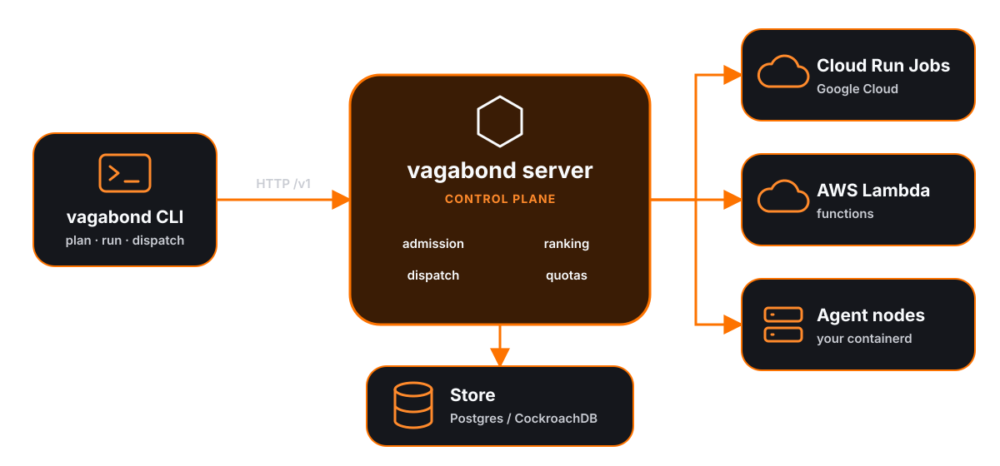

Vagabond is a compute broker. A job file declares what a task needs; the
server's configuration declares which providers exist and how much of each one's
quota may be spent. The server decides which providers can run each task, ranks
them, dispatches to the best, and records what the run used.

## Components

| Component | Command | Does |
|---|---|---|
| Server | `vagabond server` | Serves the HTTP API on `127.0.0.1:4747` and accepts agents on `127.0.0.1:4748`. Holds the provider registry, admits and ranks tasks, runs dispatches, keeps the quota ledger, and runs the [background services](background-services.md). |
| CLI | `vagabond job ...`, `execution ...`, `node ...` | Validates job files locally, then calls the server's [API](api.md). Holds no state. See the [CLI reference](cli.md). |
| Agent | `vagabond agent` | Runs on a node apart from the server. Dials the server, reports the node's architecture, CPU and memory, and runs the tasks placed on it in containerd. See [Agent](agent.md). |
| Store | Postgres or CockroachDB | Holds registered jobs, dispatches and their leases, executions, and quota usage and reservations. Replaced by in-memory stores under `-dev`. See [Database](database.md). |
| Providers | `provider` blocks in [configuration](configuration.md) | Plugins that run tasks on a backend: `cloud-run`, `lambda`, `pool` (agent nodes), and the `fake-container`, `fake-function` and `fake-worker` test providers. |

**Connections:**

- CLI to server: HTTP/JSON under `/v1`, plain or TLS per the `server` block.
- Agent to server: the agent opens one TCP connection, mutual TLS beyond
  loopback, multiplexed with yamux.
  Each side serves gRPC on the streams the other opens, so the server calls the
  agent over a connection the agent dialed. The connection closing is the
  liveness signal.
- Server to cloud providers: each provider's own SDK, only inside its plugin.

## Pipeline

| Stage | Package | Does |
|---|---|---|
| Parse and validate | `jobspec` | Decode HCL, substitute `${meta.*}`, check rules, report diagnostics against source lines |
| Load | `jobs` | Load a job for `run`, `register` or `dispatch`; check dispatch metadata against `parameterized`; store and version registered jobs |
| Begin | `dispatch` | Record the dispatch as `running`, leased to this server |
| Admission | `scheduler` | Run 13 checks in 4 tiers against every provider; each rejection carries a reason code |
| Ranking | `scheduler` | Score each candidate with `headroom` and any affinities; the score is their mean |
| Reserve | `dispatch`, `ledger` | Charge the task's declared worst case against every pool it meters, provider total and namespace share; a refusal moves to the next candidate without spending a retry |
| Submit | `dispatch`, `providers/*` | Hand the task to the plugin under a fresh execution ID |
| Watch | `dispatch` | Poll status from 2 s backing off to 15 s, stream output when the plugin can |
| Settle | `dispatch`, `ledger` | Replace the reservation with what the result says was used |
| Release | `dispatch` | Ask the plugin to delete what the execution left behind |
| Reroute | `dispatch` | On an `infrastructure` failure, move to the next ranked provider within the task's `retry` budget |

- The CLI runs parse and validate locally before sending, and the server runs
  them again.
- `job plan` stops after ranking and returns the result. It reserves nothing.
- `job run` and `job dispatch` return a dispatch ID once the dispatch is
  recorded; the rest runs in the background on the server.
- Tasks in a job run in declaration order. The first task that fails or gets
  no answer ends the job.

Each stage is described in [Scheduling](scheduling.md), [Quotas](quotas.md) and
[Dispatch](dispatch.md).

## Packages

Every package under `internal/`. `cmd/vagabond` only calls `cli.Run`.

| Package | Responsibility |
|---|---|
| `agent` | The `vagabond agent` process: connection to the server, cgroup delegation, workload reporting |
| `agent/executor` | Runs an agent's workloads in containerd |
| `agent/fingerprint` | Reads the architecture, CPU and memory an agent may use, bounded by host, cgroups and operator caps |
| `agentrpc` | Agent protocol: generated gRPC bindings for `agent.proto` and the yamux session they run over |
| `api` | HTTP API request and response bodies, and the client the CLI uses |
| `cli` | Every command, `server` and `agent` included |
| `config` | Operator configuration: providers, pools, namespaces, `store`, `server`; config file discovery |
| `dispatch` | Begin, reserve, submit, watch, settle, release, reroute; leases, resumption, reaping |
| `execution` | Execution and dispatch IDs, records, and the execution state machine |
| `integration` | End-to-end tests: a real server on Postgres with fake providers (build tag `integration`) |
| `job` | The provider-independent workload model: tasks, drivers, resources, routing |
| `jobs` | Registered jobs and versions, and the shared loading for run, register and dispatch |
| `jobspec` | Parses `.vagabond.hcl` files, substitutes metadata, validates |
| `ledger` | Quota reservations and settlement over a store, and the usage snapshot admission reads |
| `nodes` | The agent nodes connected to a server, shared by the server and pool providers |
| `plugin` | The `Provider` interface, capability model, failure classes, and the fake providers |
| `providers/aws` | The `lambda` provider: function tasks on AWS Lambda |
| `providers/gcp` | The `cloud-run` provider: container tasks on Cloud Run Jobs |
| `providers/pool` | The `pool` provider: container tasks on agent nodes |
| `ptr` | Helpers for reading optional specification fields |
| `quota` | Pool budgets, meters and periods, and arithmetic over usage |
| `registry` | Builds providers from configuration and holds their capability snapshots |
| `scheduler` | Admission and ranking |
| `server` | HTTP routes, agent connections, dispatches in the background, upkeep timers, lifecycle |
| `state` | Errors shared by every store |
| `state/memory` | In-memory job and execution stores for `-dev` and tests |
| `state/postgres` | Postgres and CockroachDB store: migrations, jobs, dispatches, executions, quota |
| `state/postgres/pgtest` | Starts Postgres and CockroachDB containers for integration tests |
| `state/postgres/sqlc` | Query code generated by sqlc |
| `version` | Build version, printed by `vagabond -version` and sent by the agent when it registers |

## Enforced boundaries

`depguard` in `.golangci.yml` fails the lint on three imports:

| Rule | Applies to | Denied |
|---|---|---|
| `scheduler-boundary` | `internal/scheduler`, `internal/job`, `internal/quota` | `internal/providers/...` |
| `cloud-sdk-boundary` | Every file outside `internal/providers/` | AWS, Google Cloud, Azure, IBM (platform services and Code Engine), Oracle, Cloudflare and DigitalOcean SDKs |
| `state-boundary` | Every non-test file outside `internal/state/` | `database/sql`, `github.com/jackc/pgx` |

Consequences:

- The scheduler reads providers only as `plugin.Capabilities`, tags and quota.
  A routing decision that needs something provider-specific needs a new
  capability attribute, not a provider-name check.
- `registry` is the one package that imports every provider plugin, to build
  them from configuration.
- Everything outside `internal/state` reaches the store through narrow
  interfaces declared by the consumer (`dispatch.Executions`,
  `ledger.Store`, the server's `serverJobs`).

## Admission inputs

Admission is a pure function over snapshots. It makes no network call, so a plan
needs no provider credentials and planning the same job twice returns the same
result.

| Input | Source | Refreshed |
|---|---|---|
| Capabilities (drivers, architectures, limits, networking, images, cost) | `Provider.Capabilities`, stored in the registry | At server startup, then every minute |
| Pool capabilities | `plugin.Live.LiveCapabilities`, the connected agent nodes | On every plan and every dispatch |
| Enabled | `enabled` in the `provider` block | Fixed at startup |
| Healthy | Whether the provider answered its last refresh | With capabilities |
| Tags | `meta` in the `provider` block, as `provider.meta.*` | Fixed at startup |
| Quota usage, provider total and namespace share | The ledger's snapshot of the store | Every 15 seconds, and before admitting each task at dispatch |

**Refresh behaviour:**

- Providers are refreshed in parallel, each under a 30-second timeout.
- A provider that fails to answer is marked unhealthy and keeps its last
  snapshot; admission rejects it with `provider-unhealthy` until a refresh
  succeeds. A failure at startup is printed as `Some providers did not answer:
  ...` and does not stop the server.
- A disabled provider is never refreshed. Its snapshot stays empty, and it is
  rejected with `provider-disabled`.
- A failed usage read keeps the last snapshot. Admission can therefore see stale
  usage, but reserving is decided by the store in one statement, so a pool is
  never over-committed by two dispatches that both saw room.
- `job plan` reads the usage snapshot as it stands, up to 15 seconds old. A
  dispatch re-reads it before admitting each task.
- Each candidate in `job plan` output shows its snapshot's observation time.

## Plugin responsibilities

A provider plugin implements `plugin.Provider`:

| Method | Does |
|---|---|
| `Name` | Returns the name the provider was configured under |
| `Capabilities` | Reports what the provider can run, with an observation time |
| `Submit` | Starts a task under the execution ID given; a synchronous provider returns the result here |
| `Status` | Reports an execution's state |
| `Result` | Returns exit code, duration, output, and billed usage if the platform reports it |
| `Cancel` | Stops an execution; stopping one already finished is not an error |

The plugin translates a normalized task into its platform's API and classifies
the platform's failures:

| Class | Meaning | Rerouted |
|---|---|---|
| `infrastructure` | The provider failed to give an answer | Yes, within the task's `retry` budget |
| `internal` | Vagabond's own fault; it would fail on every provider | No |

A task that ran and exited non-zero is not a failure class. It is the task's
result and is never rerouted.

The control plane owns everything that needs a view of more than one provider or
of the ledger: retries, backoff, rerouting, quota reservation and settlement,
execution records, leases, and output storage. A plugin must not retry
internally or choose another provider; a submission it retries itself is
capacity the ledger never records.

Optional interfaces, detected by type assertion:

| Interface | Method | Used for | Implemented by |
|---|---|---|---|
| `plugin.LogStreamer` | `StreamLogs` | Output before the execution ends | `cloud-run` |
| `plugin.Releaser` | `Release` | Deleting what an execution left behind, after its result is read | `cloud-run`, `pool` |
| `plugin.Live` | `LiveCapabilities` | Capabilities read on every plan instead of on the refresh timer | `pool` |
| `plugin.MemberSubmitter` | `SubmitTo` | Submitting only to the members admission passed | `pool` |

See [Writing a provider](writing-a-provider.md).

## Drivers

A task's `driver` names an execution contract. The set is closed; a provider
advertises which of these it satisfies.

| Driver | Contract | Providers |
|---|---|---|
| `container` | Run an arbitrary container image to completion; the exit status is the result | `cloud-run`, `pool`, `fake-container` |
| `function` | Invoke a handler that implements the platform's runtime contract | `lambda`, `fake-function` |
| `worker` | Invoke a predeployed constrained executor, such as an edge or Wasm runtime | `fake-worker` |

## Server concurrency

One server process runs these concurrently:

| Goroutine | Lifetime | Does |
|---|---|---|
| HTTP server | Until shutdown | Serves `/v1`; each request on its own goroutine |
| Agent listener | Until shutdown | Accepts agent connections, one goroutine per session |
| Dispatch | One per running dispatch | Runs the job's tasks to the end on a context that outlives the request that started it |
| Lease renewal | One per running dispatch | Renews the dispatch lease every 20 seconds; the lease runs 60 seconds |
| Log stream | One per watched execution on a `LogStreamer` provider | Copies output while the execution runs |
| Upkeep | Four tickers until shutdown | Capability refresh (1 min), usage refresh (15 s), reservation reaping (5 min), lapsed-lease claiming (30 s) |

**Startup order:** load configuration, build the registry and refresh every
provider, open and migrate the store (or build memory stores under `-dev`),
start accepting agents, listen on the API address, claim dispatches with lapsed
leases and resume each in the background, reap stale reservations, then start
upkeep and serve HTTP.

**Shutdown:** on SIGINT or SIGTERM the server stops accepting requests and gives
in-flight ones 10 seconds to finish. Running dispatches are not cancelled; their
leases lapse once the process exits, and the next server to claim them resumes
each from its recorded state.

Intervals, locks and failure handling for every loop are in
[Background services](background-services.md).

## Where state lives

| State | Location | Survives a restart |
|---|---|---|
| Registered jobs and versions | Store (`jobs`, `job_versions`) | Yes, except under `-dev` |
| Dispatches and their leases | Store (`dispatches`) | Yes, except under `-dev` |
| Executions, results and the last 64 KiB of output | Store (`executions`) | Yes, except under `-dev` |
| Quota usage and open reservations | Store (`quota_usage`, `quota_reservations`) | Yes, except under `-dev` |
| Capability snapshots and health | Server memory (registry) | No; rebuilt by the startup refresh |
| Quota usage snapshot | Server memory (ledger) | No; re-read from the store at startup |
| Connected agent nodes | Server memory (`nodes`) | No; agents reconnect with backoff from 1 to 30 seconds and re-report |
| Workloads on a node | containerd on the node, reported by the agent | Yes, on the node |
| Configuration | HCL files | Read at startup |

Everything in server memory is rebuilt from the store, the providers and the
agents, so any server on the same store can resume a dispatch another left.

## See also

- [Quickstart](quickstart.md)
- [Job specification](job-specification.md)
- [CLI reference](cli.md)
- [API](api.md)
- [Scheduling](scheduling.md)
- [Quotas](quotas.md)
- [Dispatch](dispatch.md)
- [Configuration](configuration.md)
- [Deployment](deployment.md)
- [Database](database.md)
- [Background services](background-services.md)
- [Agent](agent.md)
- [Cloud Run](providers/cloud-run.md)
- [Lambda](providers/lambda.md)
- [Writing a provider](writing-a-provider.md)
