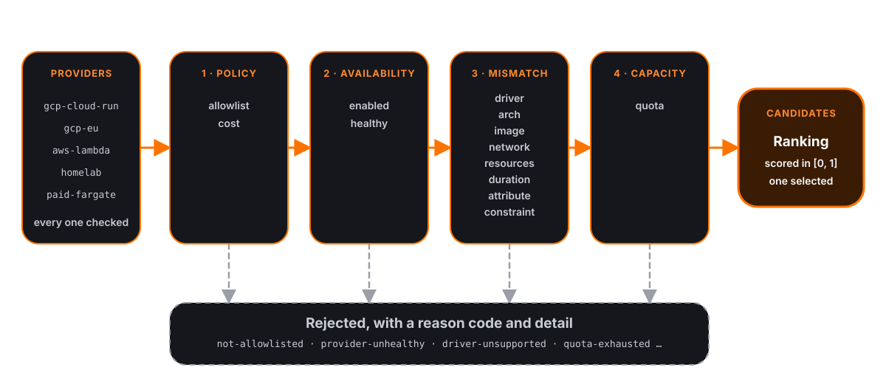

Scheduling places one task at a time in two steps. Admission runs 13 checks
against every configured provider and splits them into candidates and
rejections. Ranking scores the candidates and selects the highest. `job plan`,
`POST /v1/jobs/plan` and dispatch all run the same two steps; plan stops before
reserving anything.

## Admission



**Inputs**, one per configured provider:

| Input | Source |
|---|---|
| Capability snapshot | Last registry refresh (every minute on the server); a [pool](agent.md#pools) is read live on every plan |
| `enabled` | Provider's `enabled` attribute |
| Healthy | Whether the last capability refresh succeeded |
| Tags | Provider's `meta` block, as `provider.meta.*` |
| Quota pools and usage | Provider's pools and the namespace's share, with the ledger's last usage snapshot; see [Quotas](quotas.md) |

Admission calls no provider, reads no clock and reserves nothing. It is a pure
function of the task and these values. Dispatch re-reads usage from the store
before admitting; `job plan` uses the snapshot the server refreshes every 15
seconds.

**Task requirements** are read from the job file: `driver`, the `image` in the
driver config, `resources.cpu` (millicores), `resources.memory` (MiB),
`timeout`, `network`, `execution.architecture`, and the job's `routing` block.

### Checkers

Every checker runs against every provider, in this order.

| # | Checker | Tier | Reason code | Rejects when |
|---|---|---|---|---|
| 1 | allowlist | policy | `not-allowlisted` | `routing.providers` is non-empty and does not name the provider |
| 2 | cost | policy | `cost-policy` | The provider's estimated cost exceeds `max_cost_usd` (default 0) |
| 3 | enabled | availability | `provider-disabled` | `enabled = false` |
| 4 | healthy | availability | `provider-unhealthy` | The last capability refresh failed |
| 5 | driver | mismatch | `driver-unsupported` | The provider does not offer the task's driver |
| 6 | arch | mismatch | `arch-unsupported` | The task sets `architecture` and the provider does not offer it |
| 7 | image | mismatch | `image-unsupported` | The task names an image and the provider cannot run arbitrary images |
| 8 | network | mismatch | `network-unsupported` | `internet = true` without egress, or `private = true` without private networking |
| 9 | resources | mismatch | `resources-exceeded` | CPU or memory exceeds the provider's maximum |
| 10 | duration | mismatch | `duration-exceeded` | `timeout` exceeds the provider's maximum duration |
| 11 | attribute | mismatch | `attribute-unknown` | A constraint or affinity names an unpublished `provider.*` attribute |
| 12 | constraint | mismatch | `constraint-unmet` | A constraint evaluates false |
| 13 | quota | capacity | `quota-exhausted` | The task does not fit a quota pool and the job will not pay |

The first failing check sets the rejection's reason and detail. Later failures
are recorded as codes only (`Also` in the API) and printed by
`job plan -verbose`.

Per-check behavior:

- **allowlist**: an absent or empty `providers` list admits every provider.
- **cost**: compares the provider's `estimated_cost` against `max_cost_usd`.
  Every provider publishes an estimated cost of 0, so this check passes for
  every job.
- **healthy**: a provider starts healthy and becomes unhealthy when a refresh
  fails; it keeps its last snapshot. A disabled provider is never refreshed, so
  its snapshot is empty. A pool with no connected nodes is unhealthy.
- **arch**: a task with no `architecture` passes everywhere.
- **image**: a task with no image passes everywhere.
- **network**: only an explicit `true` is a requirement. An absent value or
  `false` passes everywhere.
- **resources**: a provider with no advertised maximum admits any size; a
  maximum of 0 admits nothing. A task that declares no CPU or memory is checked
  at the provider's default size where it publishes one (pools do), otherwise
  at 0. CPU is checked before memory; the detail names the first that fails.
- **duration**: skipped when the provider publishes no maximum, the task sets no
  `timeout`, or the timeout does not parse (job validation reports that).
- **constraint**: evaluates constraints in declaration order and reports the
  first that fails. Operators and their handling of absent attributes are in
  [job specification](job-specification.md).
- **quota**: see [Quota and willingness to pay](#quota-and-willingness-to-pay).

### Detail strings

The detail is the human-readable half of a rejection. Formats, with `%s`
placeholders filled from the task and the provider:

| Reason | Detail |
|---|---|
| `not-allowlisted` | `The job routes only to <providers, comma-separated>.` |
| `cost-policy` | `This provider charges <cost> per execution and the job allows <max_cost_usd>.` |
| `provider-disabled` | `An operator disabled this provider in configuration.` |
| `provider-unhealthy` | `This provider did not answer its last capability refresh.` |
| `driver-unsupported` | `The task uses the <driver> driver and this provider offers <drivers or none>.` |
| `arch-unsupported` | `The task requires <arch> and this provider offers <architectures or none>.` |
| `image-unsupported` | `The task runs <image> and this provider runs only its own images.` |
| `network-unsupported` | `The task requires internet egress and this provider offers none.` or `The task requires private networking and this provider offers none.` |
| `resources-exceeded` | `The task asks for <n> millicores and this provider allows <max>.` or `The task asks for <n> MiB and this provider allows <max>.` A size taken from the provider's default reads `The task declares none and is sized at <n> ...` |
| `duration-exceeded` | `The task's <timeout> timeout exceeds the <max> this provider allows.` |
| `attribute-unknown` | `Nothing publishes "<attribute>". Provider attributes are <every published attribute>, and an operator's own tags live under provider.meta.` |
| `constraint-unmet` | `The job requires <attribute> <operator> "<value>" and this provider publishes "<value>".` (or `publishes nothing for it.` when the attribute is absent) |
| `quota-exhausted` | `Pool "<pool>" has <left> of <limit> <unit> left and this task needs <charge>, and the job will not pay for capacity beyond it.` For a namespace share the detail begins `Namespace "<ns>"'s pool "<pool>"`. |

Durations print in Go form (`15m0s`). Quota amounts print in the pool's unit
with `%g`, so values of one million or more print in exponent form (`1e+06`).

### Check order

The plan table prints one line per provider, so the first failing check is the
reason a reader sees.

- **Policy first.** A provider the job excluded is reported as excluded, not as
  unsuitable for a job that was never routed there.
- **Availability second.** A disabled provider has an empty snapshot and an
  unhealthy one has a stale one. Checked later, a disabled provider would be
  reported as `driver-unsupported` because its empty snapshot offers no drivers.
- **Mismatch third**, cheapest first: set membership, booleans, integer
  comparisons, then constraint evaluation, which builds the attribute map. A
  mismatch is permanent for the pairing and is fixed only by changing the job.
- **Capacity last.** A provider that cannot run the task at all reports why,
  not its remaining allowance.

`attribute` runs before `constraint` because an attribute that does not exist
cannot fail to match.

### Transient reasons

`quota-exhausted`, `provider-disabled` and `provider-unhealthy` are transient:
the same job may be admitted later without changing. When no provider admits a
task and at least one rejection is transient, the plan is marked retryable
(`Retryable` in the API) and `job plan` prints
`At least one rejection is transient, so this may be admitted later.` Every
other reason requires a change to the job or the configuration.

### Pools

A [pool](agent.md#pools) provider is judged node by node. Each connected node
runs all 13 checks as if it were the whole provider, with its own capability
snapshot and `node.label.*` attributes, and the pool's allowlist, `enabled`,
health, tags and quota.

- At least one node passes: the pool is admitted. Its candidate carries the
  passing nodes, and the pool places the task on one of them (the one with the
  most free memory).
- No node passes: the pool is rejected with the rejection of the closest node,
  the one with the fewest failed checks (the first such node on a tie). The
  detail is prefixed `closest node <name>: `.

A node's resource maximums are its free capacity, not its size, so a busy node
is rejected with `resources-exceeded` for a task that would fit it idle.

Judging the pool as a whole would combine properties no single node has: an
arm64 node and a 16 GiB node would admit a task that needs both.

### Unknown attributes

A constraint or affinity naming an attribute under `provider.` that Vagabond
does not publish is rejected as `attribute-unknown` on every provider. The
detail lists the published attributes.

Exempt, and never checked:

- `provider.meta.*`: the provider's `meta` block.
- `node.label.*`: a pool node's labels, from the agent's `-label` flags.
  Present only while a pool's node is judged; on any other provider the
  attribute is absent.

Without this check a misspelled attribute would match no provider and read as a
capacity problem.

### Quota and willingness to pay

The quota check asks whether this task's charge fits every pool it touches, in
the provider's pools and then in the namespace's share. It does not ask whether
the provider is generally spent: a pool with room for a small task and not a
large one admits one and rejects the other. See [Quotas](quotas.md) for how a
charge is computed.

The check applies only to jobs that will not pay, meaning `max_cost_usd` is
unset or 0.

- `max_cost_usd > 0`: the quota check passes regardless of usage, and the
  dispatch reservation charges the job past the limit rather than refusing
  it. Its usage still counts. See [Quotas](quotas.md).
- A provider with no pools, or a task that charges none of its pools, always
  passes.

### Output ordering

Candidates and rejections are sorted by provider name before ranking, so a plan
of the same inputs is byte-identical apart from observation times and can be
diffed in CI.

## Ranking

Ranking scores every candidate and orders them best first. The full ordering is
kept: dispatch tries candidates in ranked order, moving to the next when a
reservation is refused or a provider fails (see [Dispatch](dispatch.md)).

### Scorers

Each scorer returns a value in `[0, 1]`. A candidate's score is the arithmetic
mean of the scorers that apply.

| Scorer | Applies | Formula |
|---|---|---|
| `headroom` | Always | `clamp(free_quota_percent / 100)` |
| `affinity` | Job declares at least one `affinity` | `matched weight / total weight` |

```
score = mean(headroom, affinity)   # affinity only when declared
```

**`headroom`** uses `provider.free_quota_percent` for this task: the lowest
remaining percentage among the pools the task charges, across the provider's
pools and the namespace's share, floored to an integer. A provider with no
pools, or none the task charges, scores 1.00. The value is clamped to `[0, 1]`.
It prefers the provider with the most allowance left, which spends the
allowance of widely eligible providers first and keeps the others for work
that can run nowhere else. See [Quotas](quotas.md#headroom).

**`affinity`** divides the summed weight of satisfied affinities by the summed
weight of all affinities. `weight` defaults to 50 and must be positive. An
unsatisfied affinity adds nothing and never rejects. A job with two affinities
weighted 75 and 25, where only the first matches, scores 0.75.

A job with no affinities has no `affinity` scorer at all, rather than a zero
averaged in. The mean, not the sum, keeps scores on one scale regardless of how
many scorers apply.

### Strategies

`routing.strategy` selects the base scorer. Affinities apply on top of it.

| Strategy | Base scorer |
|---|---|
| `free-first` (default) | `headroom` |

### Selection

- Candidates are sorted by score, descending, with a stable sort. Admission
  already ordered them by provider name, so equal scores rank by name.
- The selected provider is the first in the ranking. With no candidates,
  nothing is selected.
- The printed score is `round(score × 100)`.
- The estimated cost is the selected provider's `estimated_cost`, which is 0
  for every provider and prints as `free`.

## `job plan` output

```shell
$ vagabond job plan [-verbose] [-meta key=value] <path or name>
```

For each task, `job plan` prints a header `<job>.<task> (<driver>)`, then a
table: candidates in ranked order, then rejections in provider name order.

| Row | Columns |
|---|---|
| Candidate | provider, `admitted`, `score <n>`, `observed <UTC time>` (or `never observed`) |
| Rejection | provider, `rejected`, reason code, detail |

`-verbose` adds, under each candidate, one line per scorer (`<name> <value>`
to two decimals), and under each rejection, the other reason codes it also
failed.

After the table:

- A selection: `Selected: <provider>` and `Estimated cost: free` (or the cost
  as a bare integer).
- No candidates: `No provider can run this task.`, plus the retryable line when
  a rejection is transient.

Exit status is 0 when every task has a selection and 1 otherwise. Full flag
reference: [CLI](cli.md).

## Worked example

`examples/config.hcl` declares four fake providers. The example job
`examples/go-test.vagabond.hcl` routes to `ibm-code-engine` and `gcp-cloud-run`,
and its task asks for:

```hcl
routing {
  providers = ["ibm-code-engine", "gcp-cloud-run"]

  constraint {
    attribute = "provider.architecture"
    operator  = "set_contains"
    value     = "amd64"
  }

  affinity {
    attribute = "provider.free_quota_percent"
    operator  = ">"
    value     = "50"
    weight    = 75
  }
}

task "test" {
  driver  = "container"
  timeout = "15m"
  config { image = "golang:1.27" }
  resources {
    cpu    = 1000   # 1 vCPU
    memory = 2048   # 2 GiB
  }
  network { internet = true }
  execution { architecture = "amd64" }
}
```

Assume this month's usage in the ledger is:

| Provider | Pool | Limit | Used | Free |
|---|---|---|---|---|
| `ibm-code-engine` | `requests` | 100000 executions | 12000 | 88% |
| `ibm-code-engine` | `cpu` | 100000 vCPU-seconds | 30000 | 70% |
| `ibm-code-engine` | `compute` | 200000 GB-seconds | 140000 | 30% |
| `gcp-cloud-run` | `cpu` | 180000 vCPU-seconds | 36000 | 80% |
| `gcp-cloud-run` | `compute` | 360000 GB-seconds | 72000 | 80% |

The task charges 1 execution, 900 vCPU-seconds and 1800 GB-seconds, which fits
every pool, so both container providers are admitted.

**Admission:**

- `aws-lambda` fails `allowlist`, then `driver` (it offers `function`) and
  `image` (it runs only its own images).
- `cloudflare-workers` fails `allowlist`, then `enabled`. It was never
  refreshed, so its empty snapshot also fails `driver`, `arch`, `image`,
  `network` and `constraint`. The allowlist rejection is the one printed.

**Ranking:**

| Provider | `free_quota_percent` | headroom | affinity (`> 50`) | mean | score |
|---|---|---|---|---|---|
| `gcp-cloud-run` | min(80, 80) = 80 | 0.80 | 1.00 | 0.90 | 90 |
| `ibm-code-engine` | min(88, 70, 30) = 30 | 0.30 | 0.00 | 0.15 | 15 |

```shell
$ vagabond job plan -verbose -meta version=1.2.3 examples/go-test.vagabond.hcl
go-test.test (container)
gcp-cloud-run       admitted  score 90  observed 2026-09-28 07:31:21Z
                                headroom 0.80
                                affinity 1.00
ibm-code-engine     admitted  score 15  observed 2026-09-28 07:31:21Z
                                headroom 0.30
                                affinity 0.00
aws-lambda          rejected  not-allowlisted  The job routes only to ibm-code-engine, gcp-cloud-run.
                                driver-unsupported
                                image-unsupported
cloudflare-workers  rejected  not-allowlisted  The job routes only to ibm-code-engine, gcp-cloud-run.
                                provider-disabled
                                driver-unsupported
                                arch-unsupported
                                image-unsupported
                                network-unsupported
                                constraint-unmet
Selected: gcp-cloud-run
Estimated cost: free
```

With an empty ledger both container providers are at 100%, both score 100, and
`gcp-cloud-run` is selected on name order.

## Reason codes

| Code | Tier | Transient | Meaning |
|---|---|---|---|
| `not-allowlisted` | policy | no | The job's `providers` list excludes this provider |
| `cost-policy` | policy | no | The provider's estimated cost exceeds `max_cost_usd` |
| `provider-disabled` | availability | yes | `enabled = false` in configuration |
| `provider-unhealthy` | availability | yes | The provider did not answer its last capability refresh |
| `driver-unsupported` | mismatch | no | The provider does not offer the task's driver |
| `arch-unsupported` | mismatch | no | The provider does not offer the required architecture |
| `image-unsupported` | mismatch | no | The task names an image; the provider cannot run arbitrary images |
| `network-unsupported` | mismatch | no | The provider cannot satisfy the `network` block |
| `resources-exceeded` | mismatch | no | The task asks for more CPU or memory than the provider offers |
| `duration-exceeded` | mismatch | no | The task's `timeout` exceeds the provider's maximum |
| `attribute-unknown` | mismatch | no | A constraint or affinity names an unpublished `provider.*` attribute |
| `constraint-unmet` | mismatch | no | A constraint evaluated false |
| `quota-exhausted` | capacity | yes | A pool has no room for this task and the job will not pay |

The codes are stable: they appear in `job plan` output and in the `Reason` and
`Also` fields of [plan responses](api.md).
